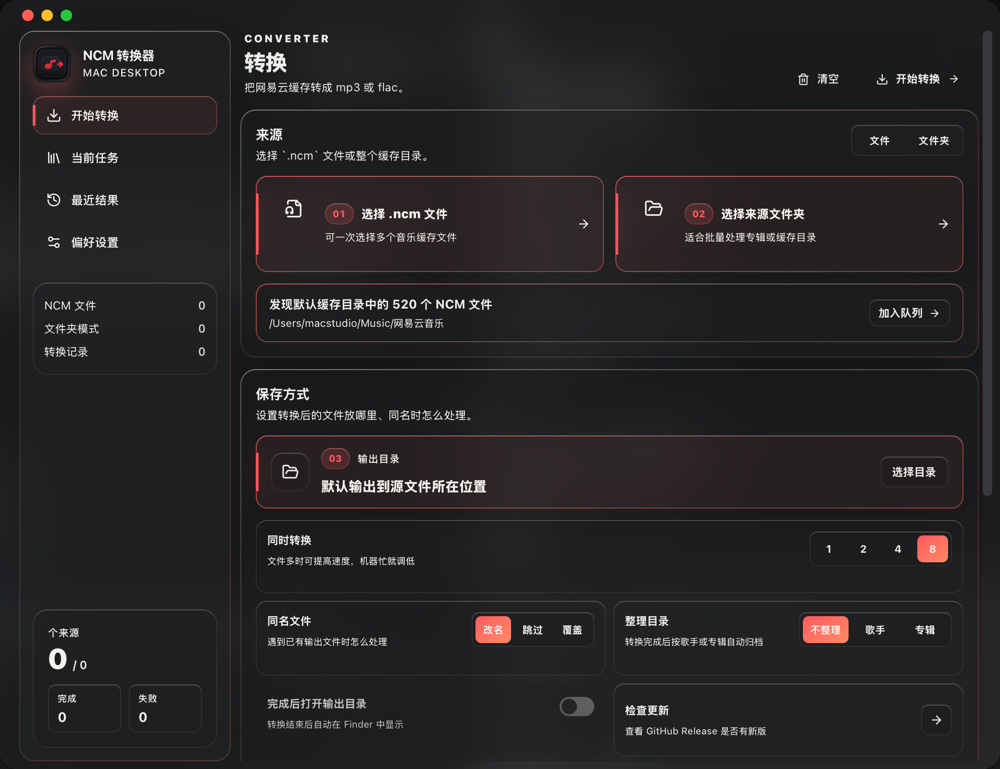

# NCM 转换器

一个 macOS 桌面小工具，用来把网易云音乐的 `.ncm` 缓存文件转换为可播放的音频文件。



## 功能

- 选择单个或多个 `.ncm` 文件
- 选择整个缓存文件夹批量转换
- 自动扫描默认网易云缓存目录
- 自定义输出目录
- 并发转换，可在 1 / 2 / 4 / 8 之间切换
- 队列进度、转换状态和失败详情
- 转换记录与 Finder 定位
- macOS 菜单栏入口
- 转换后可按歌手或专辑自动整理目录
- 应用内检查 GitHub Release 更新
- 深色半透明磨砂界面

## 下载

请到 GitHub Releases 下载最新版 DMG：

- `NCM 转换器_1.0.0_aarch64.dmg`

当前构建面向 Apple Silicon Mac。

## 技术架构

```text
React / Next.js / TypeScript / Tailwind
        ↓
Tauri 2 IPC
        ↓
Rust 后端
        ↓
ncmdump C++ sidecar
        ↓
mp3 / flac
```

前端负责界面、队列、设置和交互；Rust 负责文件扫描、历史记录、系统能力、并发任务和调用 sidecar；实际转换由 C++ `ncmdump` 完成。

## 本地开发

安装依赖：

```bash
npm install
```

启动桌面开发模式：

```bash
npm run desktop:dev
```

构建 macOS App：

```bash
npm run desktop:build
```

发布到 GitHub Release：

```bash
npm run release:github
```

发布脚本会先构建并验证 DMG，再创建或更新 `v当前版本号` 的 Release。默认要求工作区无未提交修改；临时发布可设置 `ALLOW_DIRTY_RELEASE=1`。

构建产物会生成在：

```text
src-tauri/target/release/bundle/
```

## 致谢

核心转换逻辑基于 `ncmdump` 项目。这个仓库在其基础上加入了 macOS 桌面界面、Tauri 打包、菜单栏入口、进度队列和应用级体验优化。

## License

MIT. See [LICENSE.txt](LICENSE.txt).
